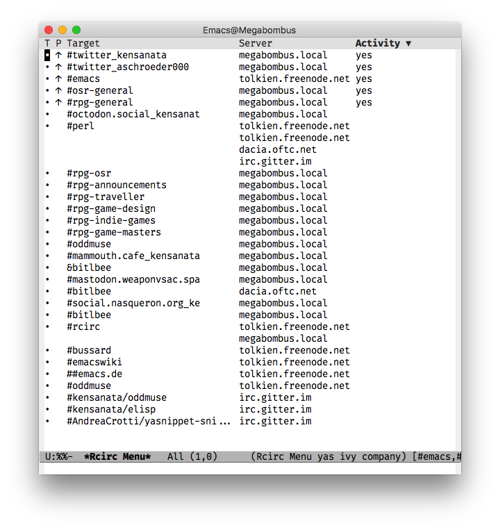

# Moved to ELPA!

The development of `rcirc-menu` has moved to
[ELPA](http://elpa.gnu.org/).

# Rcirc Menu

If you are connected to too many channels, `rcirc-track-minor-mode` is
useless because the modeline is too short. Bind `rcirc-menu` to a key
instead:

```elisp
(global-set-key (kbd "C-c r") 'rcirc-menu)
```

The result:


